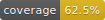

# coverage-badge



A Rust CLI tool that generates shields.io-style SVG badges for test coverage.

## Installation

```bash
cargo install --path .
```

## Usage

```bash
coverage-badge --coverage <PERCENTAGE> --output <PATH>
```

### Arguments

- `--coverage, -c` - Coverage percentage (0-100, decimals allowed)
- `--output, -o` - Output path for the SVG file

### Examples

```bash
# Generate a badge for 85% coverage
coverage-badge -c 85 -o assets/coverage.svg

# With decimal precision
coverage-badge --coverage 72.5 --output .github/badges/coverage.svg
```

### In your README

```markdown

```

## Color Thresholds

| Coverage | Color |
|----------|-------|
| < 50% | Red |
| 50-79% | Yellow |
| ≥ 80% | Green |

## License

MIT
